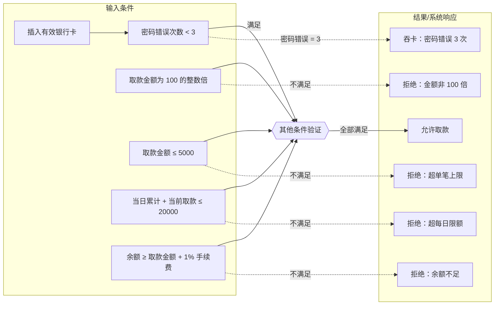

# ATM 取款功能测试设计文档

## 1. 需求与优先级表

| 编号 | 功能需求说明 | 类型 | 优先级 |
| ---- | ---------------------------- | ---- | ------ |
| R1 | 用户插卡后需要验证密码（3 次错误吞卡） | 显性 | 高 |
| R2 | 单次取款金额必须为 100 的整数倍 | 显性 | 中 |
| R3 | 单笔取款不得超过 5000 元 | 显性 | 中 |
| R4 | 每日累计取款不得超过 20000 元 | 显性 | 中 |
| R5 | 账户余额需能支付“取款金额 + 手续费” | 显性 | 中 |
| R6 | 手续费为取款金额的 1%，向上取整到分 | 显性 | 中 |
| R7 | 每笔取款时需同时校验余额及当日额度 | 隐性 | 中 |
| R8 | 密码错误三次后银行卡应自动锁定（吞卡） | 隐性 | 高 |
| R9 | 用户界面应提示错误信息和剩余尝试次数 | 隐性 | 低 |
| R10 | 插卡 5 秒无操作自动退卡 | 隐性 | 低 |
| R11 | 吞卡后打印/显示客服电话与处理指引 | 隐性 | 低 |

---

## 2. 因果图（Mermaid）

---

## 3. 判定表

| 条件编号 / 条件名 | T1 | T2 | T3 | T4 | T5 | T6 |
| ----------------- | -- | -- | -- | -- | -- | -- |
| C1: 有效卡 | Y | Y | Y | Y | Y | Y |
| C2: 密码错误次数 < 3 | Y | Y | Y | Y | Y | N |
| C3: 取款金额为 100 倍 | Y | N | Y | Y | Y | Y |
| C4: 取款金额 ≤ 5000 | Y | Y | N | Y | Y | Y |
| C5: 当日累计 + 当前 ≤ 20000 | Y | Y | Y | N | Y | Y |
| C6: 余额充足 | Y | Y | Y | Y | N | Y |
| **结果** | | | | | | |
| R1: 允许取款 | ✔️ | | | | | |
| R2: 拒绝：金额非 100 倍 | | ✔️ | | | | |
| R3: 拒绝：超单笔上限 | | | ✔️ | | | |
| R4: 拒绝：超每日限额 | | | | ✔️ | | |
| R5: 拒绝：余额不足 | | | | | ✔️ | |
| R6: 吞卡（密码错误 3 次） | | | | | | ✔️ |

---

## 4. 测试用例一览表

| 编号 | 前置条件 & 输入 | 预期结果 | 优先级 |
| ---- | -------------------------------- | ---------------- | ---- |
| TC01 | 卡有效，密码正确，取款 5000 元，余额充足 | 成功取款 | 高 |
| TC02 | 密码错误 3 次 | 吞卡，禁止操作 | 高 |
| TC03 | 取款金额 105 元 | 提示必须为 100 倍 | 中 |
| TC04 | 取款金额 6000 元 | 提示超单笔限额 | 中 |
| TC05 | 当日已取 15000，再取 6000 元 | 提示超出每日限额 | 中 |
| TC06 | 余额 4 999 元，取款 4 900 元（需 4 949） | 成功取款 | 中 |
| TC07 | 余额 1 000 元，取款 1 000 元（不足手续费） | 提示余额不足 | 中 |
| TC08 | 取款 4 999 元，余额 5 048 元 | 成功取款 | 中 |
| TC09 | 取款 20 000 元（单笔） | 拒绝：单笔超限 | 中 |
| TC10 | 取款 0 元 | 提示金额非法 | 低 |
| TC11 | 取款 -100 元 | 提示金额非法 | 低 |
| TC12 | 取款 100 元（最小合法） | 成功取款 | 中 |
| TC13 | 取款 5 001 元 | 提示超单笔限额 | 中 |
| TC14 | 余额 = 取款本金 + 手续费 – 0.01 | 提示余额不足 | 中 |
| TC15 | 余额 = 取款本金 + 手续费 | 成功取款 | 中 |
| TC16 | 第 N 次取款累计金额达到 20 000 元 | 成功取款 | 中 |
| TC17 | 次日再尝试取款 100 元 | 提示超每日限额 | 中 |
| TC18 | 交易中断（网络波动） | 需检查补记账 / 对账 | 中 |
| TC19 | 取款过程中突然断电 | 需回滚或补账策略 | 中 |

---

> 本文档可直接复制到支持 Mermaid 的 Markdown 查看器（如 VS Code、Typora、GitHub）中，以渲染因果图。若需导出 Word/Excel 或其他格式，请告知。